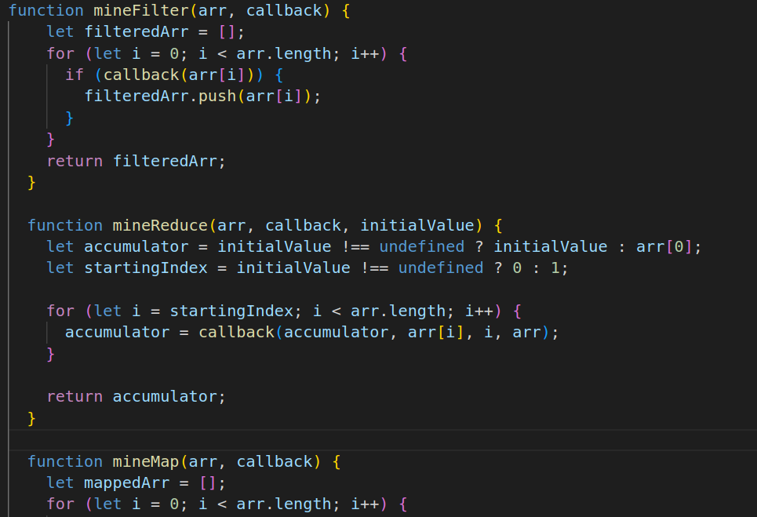
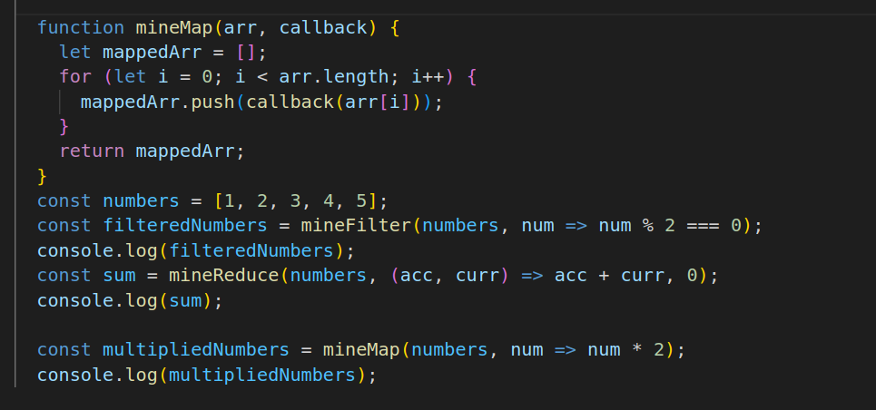

# Custom Array Methods

* This repository contains custom implementations of essential array methods in JavaScript, offering functionality similar to the standard filter, reduce, and map methods.

### mineFilter
The mineFilter function mirrors the behavior of the filter method present in JavaScript arrays. It takes an array and a callback function as arguments, returning a new array containing elements that satisfy the provided callback's conditions.

* 

### mineReduce
* The mineReduce function replicates the functionality of the reduce method in JavaScript arrays. It iterates over an array, applying a callback function against an accumulator and each element, resulting in a single output value. 

### mineMap
* The mineMap function mimics the behavior of the map method in JavaScript arrays. It transforms each element of the array using a provided callback function and returns a new array.

